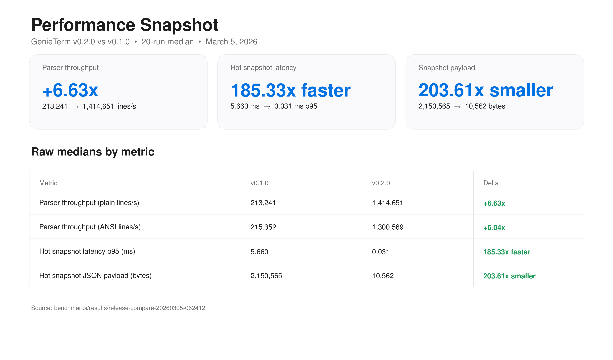

# GenieTerm


GenieTerm is a native macOS terminal focused on performance and usability.

Top half is a real terminal. Bottom half is a simple command composer you can edit with mouse/keyboard and send instantly.

## Product Principles

- Fast by default: keep the hot path small and predictable.
- Native by default: behave like a macOS app, not a web wrapper.
- Minimal by default: only ship features that improve daily terminal work.

## What We Open Source

This repository includes the full product-critical stack:

- Rust terminal core (PTY, ANSI parser, screen buffer)
- Native macOS app (SwiftUI/AppKit + CoreText rendering path)
- FFI boundary and headers
- Benchmark and regression tooling
- Documentation, roadmap, and contribution guides

Open-source scope details: [OPEN_SOURCE_SCOPE.md](OPEN_SOURCE_SCOPE.md)

## Quick Start

Download:

- [Latest release](https://github.com/Ry3nG/GenieTerm/releases/latest)

Build from source:

```bash
./run.sh
```

Manual build:

```bash
cargo build --lib
cd native/GenieTerm
swift build
swift run
```

Requirements:

- macOS 13+
- Rust 1.70+
- Swift 5.9+

## Performance

v0.2.0 vs v0.1.0 (20-run median): parser throughput improved ~6x, hot snapshot latency improved ~185x, snapshot payload reduced ~203x.



Reproduce and inspect full results:

- [benchmarks/README.md](benchmarks/README.md)

## Project Docs

- [ROADMAP.md](ROADMAP.md)
- [CLAUDE.md](CLAUDE.md)
- [CONTRIBUTING.md](CONTRIBUTING.md)

## License

[MIT](LICENSE)
