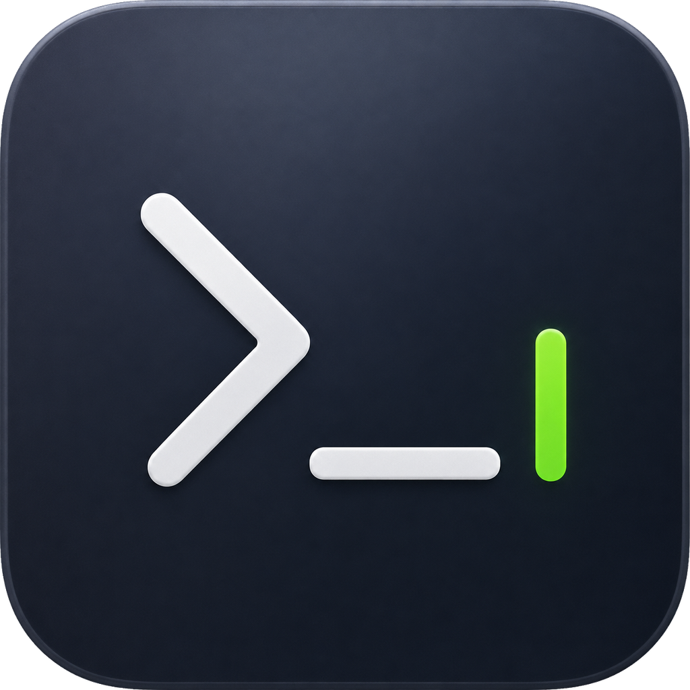

<p align="center">
  
</p>

# GenieTerm

GenieTerm is a semantic, remote-native terminal for command blocks, durable sessions, and file workflows.

## Downloads

Official installers and update packages are published on the [GitHub Releases page](https://github.com/Ry3nG/GenieTerm/releases). macOS packages include Apple Silicon and Intel builds. Windows x64 preview packages may appear as prereleases; stable Windows packages appear after the Windows release gate passes. Use the NSIS `.exe` installer for normal installation or the ZIP for a portable unpacked copy. Windows ARM64 is outside the first Windows release.

Release files should be downloaded from that repository's Release page. The Windows release criteria and installation checks are in [`docs/windows-release-gate.md`](docs/windows-release-gate.md).

Windows folder downloads use the Windows [OpenSSH Client](https://learn.microsoft.com/en-us/windows-server/administration/openssh/openssh_install_firstuse). If `scp.exe` is unavailable, enable that optional Windows feature before downloading remote folders.

It is built on the Wave Terminal codebase and keeps Wave's runtime: durable remote sessions, inline previews, built-in editing, the `genie`/`wsh` helper, and cross-platform Electron/Go packaging. The product is narrower: the terminal understands command boundaries, status, output, duration, and remote file identity on that same session path.

## Current Focus

- Semantic command blocks as the default presentation; classic xterm is a compatibility mode over the same `TerminalView` / `TermWrap` runtime.
- Inline completion from the Fig spec corpus, history, and paths.
- Optional natural-language command composer (propose a command; never auto-run). No AI chat panel.
- Dark, Apple-inspired visual identity.
- Remote file and transfer flows. The parser accepts `genie://` and `wsh://`; public presentation is still catching up.

## Product Direction

See [`docs/GENIETERM-ROADMAP.md`](docs/GENIETERM-ROADMAP.md). Short version:

- Command blocks with gutter, status, duration, copy, re-run, and jump.
- Durable local and remote sessions that stay ordinary xterm sessions underneath.
- Remote inspect, preview, upload, download, and a transfer queue.
- Additive `genie` / `genie://` aliases that do not break `wsh` / `wsh://`.
- App builder and Wave AI chat stay off the default path.

  1.0 is terminal + durable remote + files — not a Wave-sized surface.

## Relationship To Wave

GenieTerm is based on [Wave Terminal](https://github.com/wavetermdev/waveterm), an Apache-2.0 open-source terminal.

This fork keeps the upstream license and acknowledgements while developing an independent product direction.

## Development

Install dependencies:

```sh
task init
```

Run the baseline quality gate before merging release-bound work:

```sh
task v1:gate
```

Run targeted tests for a quick GenieTerm transfer-slice regression:

```sh
npm test -- frontend/util/transferutil.test.ts emain/transfer/download-folder.test.ts frontend/util/previewutil.test.ts --run
```

Build a local macOS package outside File Provider-managed folders:

```sh
GENIETERM_BUILD_OUTPUT=/private/tmp/genieterm-make task package
```

On Windows x64, build and check an unpacked app and release packages on a native machine with Node 22, Go, Task, and Zig installed:

```powershell
task package -- --win --x64
node scripts/verify-windows-package.mjs make --window-smoke
```

Install the arm64 app locally:

```sh
rm -rf /Applications/GenieTerm.app
ditto --norsrc /private/tmp/genieterm-make/mac-arm64/GenieTerm.app /Applications/GenieTerm.app
```

## License

GenieTerm is licensed under Apache-2.0. See [LICENSE](./LICENSE) and [ACKNOWLEDGEMENTS.md](./ACKNOWLEDGEMENTS.md).
